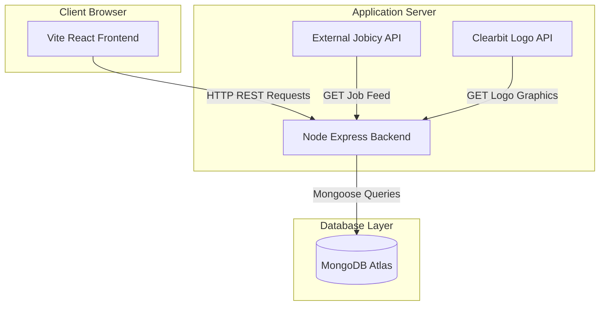

# Project Report: SkillFetch Portal
**A Database-Backed, Real-Time Synchronized Remote Job Board**

*Document Classification: Academic & Technical Project Report*  
*Version: 1.2.0*  
*Prepared by: Project Development Team*  

---

## 1. Executive Summary

The **SkillFetch Portal** is a full-stack, double-tier client-server web application designed to bridge the structural gap between distributed talent pools and expanding organizations. By integrating a React single-page interface with a Node.js Express backend and a MongoDB database, the platform provides candidates with career advancement utilities and recruiters with automated pipeline management tools.

Historically, remote job boards have suffered from stale postings, lack of localized career insights, and fragmented application tracking. SkillFetch addresses these shortcomings by introducing:
*   **Automated Jobicy API Synchronization:** An integration module that pulls remote job listings on startup, checks for duplicates, and upserts them locally into MongoDB.
*   **Role-Based Access Control (RBAC):** Distinct dashboards for Candidates, Employers, and Administrators.
*   **Candidate Networking Hub:** A localized connection engine allowing job seekers to request, accept, or remove professional connections.
*   **Applicant Tracking System (ATS) Console:** A split-screen review dashboard for employers featuring candidate profiles, custom application cover letters, and live PDF resume previews.

This report outlines the design philosophy, technical requirements, system architecture, database modeling, and software engineering methodology used to develop the SkillFetch Portal.

---

## 2. Introduction

### 2.1 Background Context
The landscape of software development and technology employment has undergone a paradigm shift. Remote work is no longer a temporary perk; it is a permanent operating model for startups and multinational enterprises. In India, this shift is highlighted by the expansion of **Global Capability Centers (GCCs)** in Tier-1 cities like Bangalore and Hyderabad, alongside emerging tech corridors in Tier-2 locations such as Kochi, Trivandrum, and Pune. 

However, finding high-quality remote opportunities remains a challenge. Job seekers must navigate generic job boards filled with outdated entries, and employers must screen hundreds of unstructured applications without centralized tools.

### 2.2 System Description
SkillFetch is a dedicated solution built to solve these coordination problems. The application is built using a modern **MERN (MongoDB, Express, React, Node.js) architecture**, optimized for speed via the **Vite** bundler and styled using clean, responsive **Vanilla CSS**. 

The system operates around three user archetypes:
1.  **Candidates:** Search and filter jobs, maintain a professional profile containing contact info, skills, education, and work history, upload resumes, and connect with other candidates to grow their network.
2.  **Employers:** Post new opportunities, manage their active listings, and move applicants through the hiring stages (Applied, Shortlisted, Hired, Rejected) via an intuitive, split-screen ATS panel.
3.  **Administrators:** Monitor system metrics, moderate user accounts (suspending/reinstating access), and perform cascading deletions to keep the database clean and compliant.

---

## 3. Objectives

The development of the SkillFetch Portal was guided by specific commercial, functional, and technical objectives.

### 3.1 Commercial and Functional Objectives
*   **Reduce Stale Listings:** Automatically populate the job board with active, verified remote positions by integrating with external APIs.
*   **Streamline Candidate Screening:** Provide recruiters with a single dashboard that displays candidate bios, pitches, and resumes side-by-side to reduce screening times.
*   **Promote Networking:** Allow candidates to build connections within the platform, facilitating career growth and peer referrals.
*   **Ensure Data Quality:** Establish administrative controls to purge inactive accounts, spam posts, and outdated applications.

### 3.2 Technical Objectives
*   **Role-Based Security:** Prevent candidates from viewing candidate review pages, block employers from applying to jobs, and restrict administrative controls to authenticated system admins.
*   **State-Driven Single-Page Application (SPA):** Maintain a fluid user experience (UX) without full-page reloads, using state-based routing and transitions.
*   **Client-Side Performance:** Optimize searches and filters by caching fetched collections in state arrays, executing array searches locally to minimize API traffic.
*   **Robust Database Integrity:** Define mongoose schemas with strict validation constraints and cascading delete triggers to prevent orphaned records in MongoDB.
*   **Zero Image Placeholders:** Generate SVG profile graphics dynamically on the client side using user initials and color gradients, ensuring missing logos do not break the visual layout.

---

## 4. Scope and Deliverables

### 4.1 Project Scope

The project scope is divided into functional modules and database boundaries:

#### 4.1.1 In-Scope Features
*   **Authentication & Session Management:** User registration and login using role selectors (Candidate vs. Recruiter) and persistent browser sessions via `localStorage`.
*   **API Seeder & Syncer:** Node-based HTTPS module that polls the Jobicy API, parses payload objects, downloads company logos from Clearbit, and seeds the database on initialization.
*   **Search & Dynamic Filters:** Text search boxes, location filter tools, and job type pills on the Home Feed and Job Listings.
*   **Interactive Professional Profiles:** Candidate profiles supporting work experience lists, education history, and PDF document uploading.
*   **Direct Application Engine:** Forms for candidate applications that store cover letters and link candidate models to job models.
*   **Candidate Networking Engine:** User-to-user connection schemas supporting pending, accepted, and rejected invitation states.
*   **Split-Screen ATS Reviewer:** A portal modal rendering candidate details alongside an interactive PDF viewing frame.
*   **Admin Moderation Dashboard:** Toggles to suspend accounts and execute cascading user purges.

#### 4.1.2 Out-of-Scope Features
*   *Real-time Chat Messaging:* Candidate-to-candidate messaging is deferred to a future phase.
*   *Direct PDF Resume Parser:* Automating form parsing from uploaded PDFs is outside the current release scope.
*   *Integrated Payment Gateways:* Premium recruiter packages and paid job pins are deferred.

### 4.2 System Deliverables

| Deliverable | Format/Technology | Description |
| :--- | :--- | :--- |
| **Frontend Source Code** | React (v18.2), Vite (v5.2) | Responsive, component-based user interface with custom state routing. |
| **Backend API Source Code** | Node.js, Express.js | RESTful API endpoints for authentication, jobs, applications, and connections. |
| **Database Schema Scripts** | MongoDB / Mongoose ODM | Data models defining validation rules and collection structures. |
| **Data Sync Engine** | Node HTTPS Module, Clearbit API | Automated seeder script that fetches and populates live jobs. |
| **Design System Stylesheet** | Vanilla CSS (`index.css`) | Curated color palettes, cards, modals, grids, and mobile navigation sheets. |
| **User & Deployment Manual** | Markdown Document | Step-by-step setup guides and testing credentials. |

---

## 5. Methodology

The development of the SkillFetch Portal followed an structured software engineering methodology to ensure design consistency, component reuse, and clean database relationships.

### 5.1 SDLC Model: Agile Scrum
The project utilized the **Agile Scrum** methodology. Development was divided into two-week sprints:
1.  *Sprint 1 (Architecture & Database):* Database modeling, Express routing setup, seeder script building, and basic authentication page creation.
2.  *Sprint 2 (Frontend Layout & Core Feed):* Implementation of the global CSS styling tokens, navigation components, and the Home Feed.
3.  *Sprint 3 (Dashboards & ATS Modal):* Development of the Candidate dashboard, Profile forms, Employer ATS split-screen modal, and Admin controls.
4.  *Sprint 4 (Integration, Testing & Polish):* End-to-end integration testing, mobile styling updates, and performance tuning.

### 5.2 System Architecture
SkillFetch is built on a **Client-Server Architecture** utilizing a decoupled frontend and backend:



*   **Presentation Layer (Frontend):** Renders views, catches user interactions, and manages rendering logic. It runs as a Single Page Application (SPA), using state parameters inside `App.jsx` to render pages.
*   **Application Layer (Backend):** An Express application that listens on port `5000` (development) or dynamically binds to cloud ports (production). It handles authentication, validates request payloads, and exposes RESTful API endpoints.
*   **Database Layer:** A MongoDB Atlas cluster. Mongoose ODM is integrated at the server layer to enforce data validation and schemas.

---

### 5.3 Database Modeling (Mongoose Schemas)

The database consists of five collections: `users`, `jobs`, `applications`, `connections`, and `stories`.

#### 5.3.1 User Schema
Stores candidate profiles, employer company info, and administrator credentials.
```javascript
const userSchema = new mongoose.Schema({
  name: { type: String, required: true },
  email: { type: String, required: true, unique: true },
  password: { type: String, required: true },
  role: { type: String, enum: ['candidate', 'employer', 'admin'], default: 'candidate' },
  isSuspended: { type: Boolean, default: false },
  avatar: { type: String, default: '' },
  headline: { type: String, default: '' },
  phone: { type: String, default: '' },
  location: { type: String, default: '' },
  bio: { type: String, default: '' },
  skills: { type: String, default: '' },
  education: { type: String, default: '' },
  experience: { type: String, default: '' },
  resume: { data: Buffer, contentType: String, name: String },
  resumeName: { type: String, default: '' },
  companyName: { type: String, default: '' },
  companyLocation: { type: String, default: '' },
  companyLogo: { type: String, default: '' },
  companyDesc: { type: String, default: '' }
}, { timestamps: true });
```

#### 5.3.2 Job Schema
Holds listings created by employers or synced from the external API.
```javascript
const jobSchema = new mongoose.Schema({
  employerId: { type: String, default: '' },
  companyName: { type: String, required: true },
  companyLogo: { type: String, default: '' },
  title: { type: String, required: true },
  category: { type: String, required: true },
  type: { type: String, required: true },
  location: { type: String, required: true },
  salaryRange: { type: String, default: '' },
  experienceLevel: { type: String, default: 'Junior' },
  skillsRequired: { type: String, default: '' },
  description: { type: String, required: true },
  qualifications: { type: String, default: '' }
}, { timestamps: true });
```

#### 5.3.3 Application Schema
Links candidates to jobs and tracks their status in the recruiter's hiring funnel.
```javascript
const applicationSchema = new mongoose.Schema({
  jobId: { type: mongoose.Schema.Types.ObjectId, ref: 'Job', required: true },
  candidateId: { type: String, required: true },
  coverLetter: { type: String, required: true },
  status: { type: String, enum: ['Applied', 'Shortlisted', 'Hired', 'Rejected'], default: 'Applied' }
}, { timestamps: true });
```

#### 5.3.4 Connection Schema
Manages candidate-to-candidate networking relationships.
```javascript
const connectionSchema = new mongoose.Schema({
  senderId: { type: mongoose.Schema.Types.ObjectId, ref: 'User', required: true },
  receiverId: { type: mongoose.Schema.Types.ObjectId, ref: 'User', required: true },
  status: { type: String, enum: ['pending', 'accepted', 'rejected'], default: 'pending' }
}, { timestamps: true });
```

#### 5.3.5 Story Schema
Stores tech news and career articles loaded by the database seeder.
```javascript
const storySchema = new mongoose.Schema({
  title: { type: String, required: true },
  summary: { type: String, required: true },
  content: { type: String, required: true },
  author: { type: String, required: true },
  readTime: { type: String, default: '3 min read' }
}, { timestamps: true });
```

---

## 6. Project Activities

The development process was executed in structured, sequential activities.

### 6.1 Requirement Analysis & Architecture Design
The initial phase involved documenting system requirements and designing layout wireframes. The team established a core visual theme based on a warm grey canvas (`#f3f2f0`) and high-contrast blue details (`#0a66c2`) to create a professional look similar to LinkedIn. It was decided to build the app without heavy styling frameworks to keep the load speeds fast and responsive.

### 6.2 Backend Construction & Database Seeding
The API server and database seeding modules were built first to establish a solid foundation for the frontend:
*   **API Routes:** Restful endpoints were set up in [routes.js](file:///d:/project/skillfetch-portal/backend/routes.js) to handle registrations, logins, job queries, applications, and connection states.
*   **Database Seeder:** Built inside [seed.js](file:///d:/project/skillfetch-portal/backend/seed.js) to automate database initialization:
    1.  Clears old data during a clean build.
    2.  Creates test accounts with mock resumes.
    3.  Fetches active remote listings from the Jobicy API.
    4.  Calls the Clearbit API to get company logo graphics.
    5.  Seeds 50 India-focused career stories into MongoDB.

### 6.3 Frontend Shell & Design System
Developer 1 configured the global CSS stylesheet and build rules:
*   **CSS Utility Classes:** Established classes for buttons (`.btn`, `.btn-secondary`, `.btn-danger`), forms (`.form-group`, `.form-control`), cards (`.card`), and animations (`@keyframes fadeSlideUp`).
*   **Global Layout Wrapper:** Built [Navbar.jsx](file:///d:/project/skillfetch-portal/frontend/src/Components/Navbar.jsx) to handle desktop header rendering and mobile bottom navigation, along with [App.jsx](file:///d:/project/skillfetch-portal/frontend/src/App.jsx) to coordinate state-based routing.
*   **SVG Initial Avatars:** Coded [avatars.js](file:///d:/project/skillfetch-portal/frontend/src/utils/avatars.js) to generate customized inline SVG graphics using user initials and linear gradients, ensuring clean avatars for all profiles.

### 6.4 Core Feature Development
Developer 2 implemented the interactive pages and user dashboards:
*   **Job Board Feed:** Coded [HomeFeed.jsx](file:///d:/project/skillfetch-portal/frontend/src/Pages/HomeFeed.jsx) to manage search queries, input autocomplete lists, category filter toggles, sidebar cards, and career stories modals.
*   **Candidate Tools:** Developed [Profile.jsx](file:///d:/project/skillfetch-portal/frontend/src/Pages/Profile.jsx) to handle resume uploads, alongside [Network.jsx](file:///d:/project/skillfetch-portal/frontend/src/Pages/Network.jsx) to request and respond to connections.
*   **Employer ATS Panel:** Programmed [EmployerDashboard.jsx](file:///d:/project/skillfetch-portal/frontend/src/Pages/EmployerDashboard.jsx) to calculate dashboard metrics and build the split-screen ATS modal, which displays applicant info side-by-side with an iframe PDF resume preview.
*   **Admin Panel:** Created [AdminPanel.jsx](file:///d:/project/skillfetch-portal/frontend/src/Pages/AdminPanel.jsx) to manage user accounts and enable administrative suspensions.

### 6.5 Quality Assurance, Integration & Responsive Testing
The final phase involved testing the integration between the client and server:
*   **Cascading Deletions:** Verified that deleting an employer successfully deleted their jobs and associated applications, and deleting a user purged their connection logs.
*   **Mobile Adaptability:** Tested media queries at the `768px` and `600px` breakpoints, verifying that tables converted to vertical layouts and the split-screen ATS modal hid buggy mobile frames in favor of download links.
*   **Edge Case Handlers:** Added HTTP request timeout limits and mock fallback arrays in the Home Feed to keep the page functional even if the backend is offline.

---
*End of Report.*
